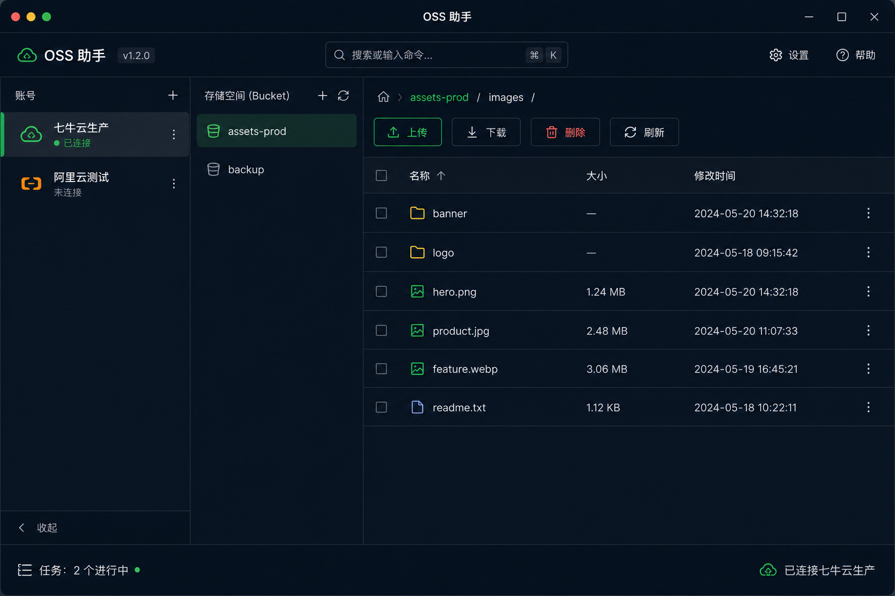
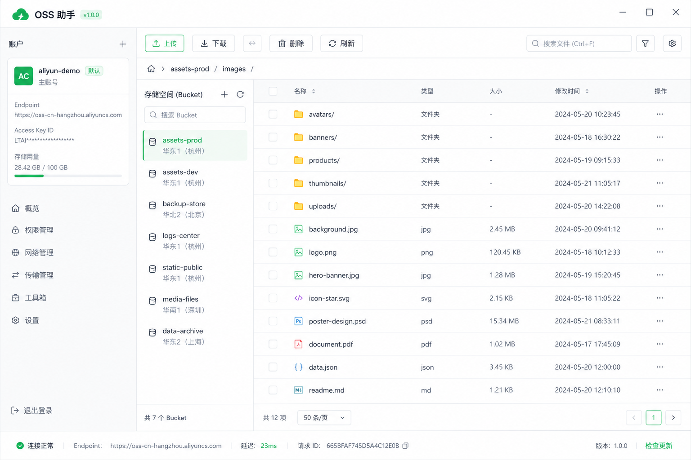
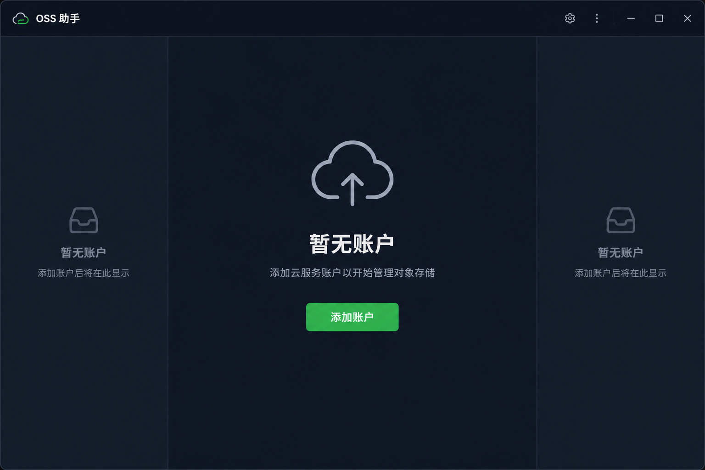
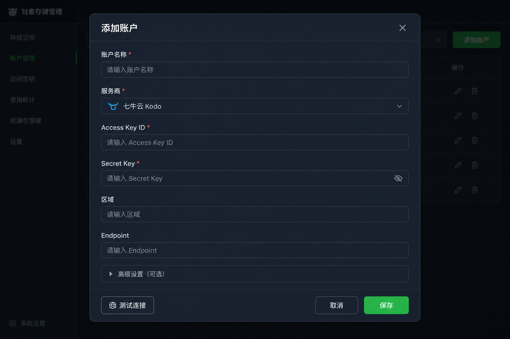
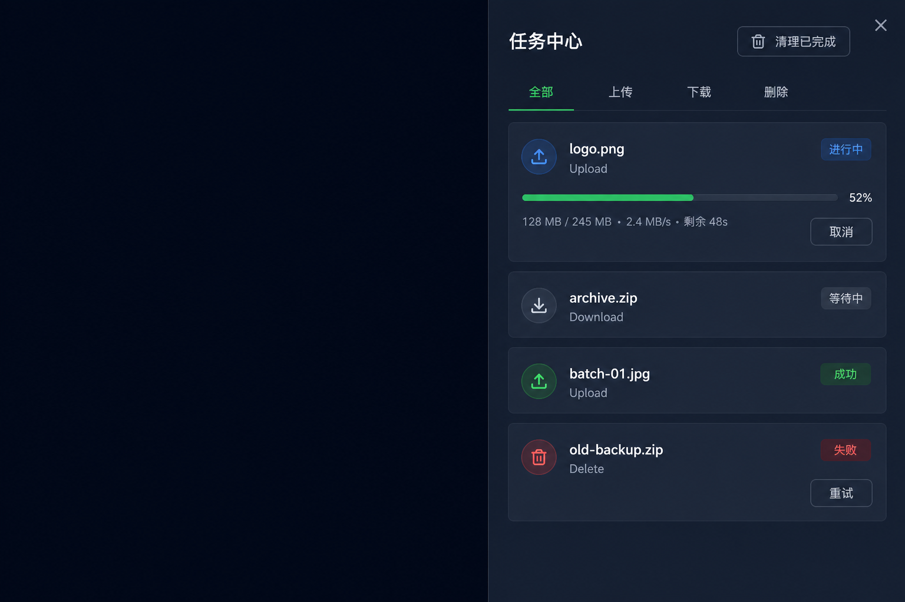
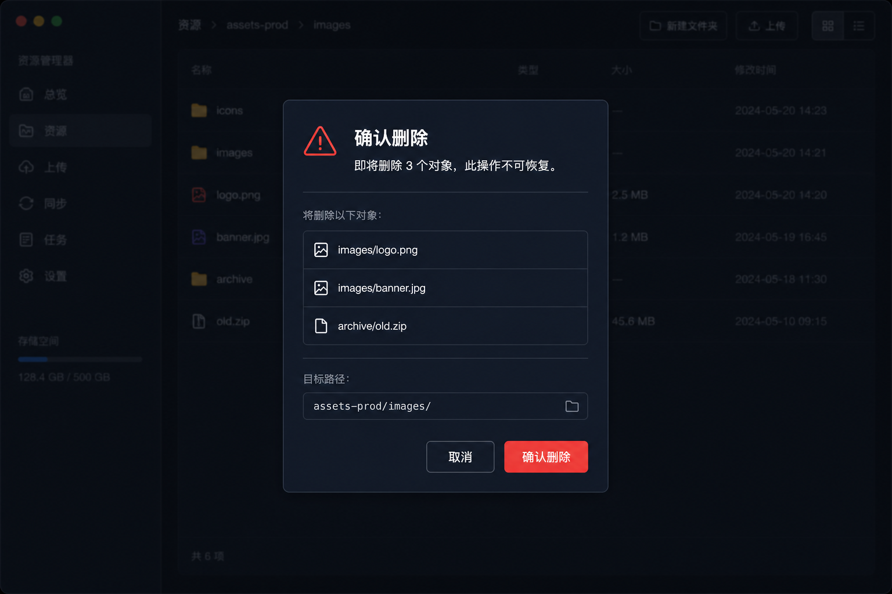
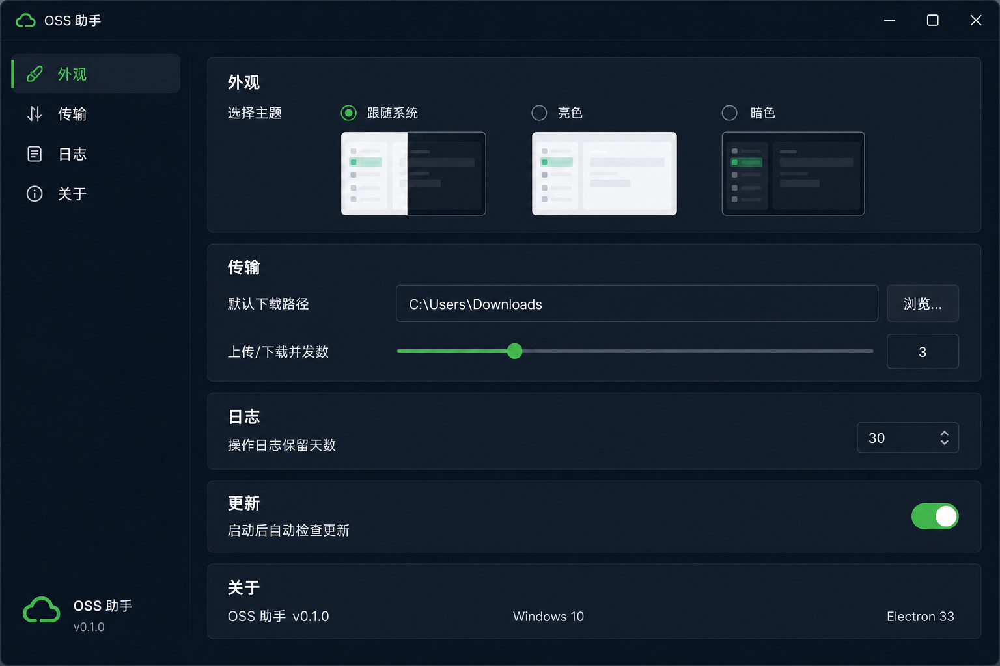

# OSS 助手 - 界面设计文档

> 基于 [PRD.md](../PRD.md) 与 ui-ux-pro-max 设计系统生成  
> 生成日期：2026-06-05

## 1. 设计系统摘要

### 1.1 产品定位

开发者工具 / 桌面文件管理器，面向多云对象存储统一管理场景。

### 1.2 视觉风格

| 维度   | 选型                          | 说明                |
| ------ | ----------------------------- | ------------------- |
| 主风格 | Dark Mode (OLED) + Minimalism | 低干扰、工具型界面  |
| 字体   | Inter                         | 全局使用，含中英文  |
| 图标   | Lucide React                  | 24×24，线宽一致     |
| 组件库 | shadcn/ui + Radix UI          | 可复制、可定制      |
| 主题   | 暗色默认 + 亮色支持           | 跟随系统 / 手动切换 |

### 1.3 色彩令牌

| 角色       | 暗色模式  | 亮色模式  | 用途             |
| ---------- | --------- | --------- | ---------------- |
| Background | `#0F172A` | `#FFFFFF` | 主背景           |
| Sidebar    | `#1E293B` | `#F8FAFC` | 侧栏、卡片       |
| Border     | `#334155` | `#E2E8F0` | 分割线           |
| Text       | `#F8FAFC` | `#0F172A` | 主文字           |
| Muted      | `#94A3B8` | `#475569` | 次要文字         |
| Accent/CTA | `#22C55E` | `#22C55E` | 主操作、连接成功 |
| Danger     | `#EF4444` | `#EF4444` | 删除、错误       |
| Info       | `#3B82F6` | `#3B82F6` | 进行中状态       |

### 1.4 设计系统文件

- 全局规范：`design-system/oss-assistant/MASTER.md`
- 页面覆盖：`design-system/oss-assistant/pages/*.md`

---

## 2. 信息架构

```text
OSS 助手
├── 主界面（文件浏览）
│   ├── 账户侧栏
│   ├── 存储桶侧栏
│   └── 文件列表主区
├── 账户管理（Dialog）
│   ├── 添加账户
│   └── 编辑账户
├── 任务中心（Sheet）
│   ├── 上传任务
│   ├── 下载任务
│   └── 删除任务
├── 设置（独立页面 / Dialog）
│   ├── 外观
│   ├── 传输
│   ├── 日志
│   └── 关于
└── 帮助与诊断
```

---

## 3. 界面设计一览

### 3.1 主界面（暗色）



**布局：** 三栏结构

| 区域       | 宽度   | 内容                       |
| ---------- | ------ | -------------------------- |
| 账户侧栏   | 200px  | 账户列表 + 连接状态点      |
| 存储桶侧栏 | 220px  | 当前账户下的 Bucket 列表   |
| 文件主区   | flex-1 | 面包屑 + 工具栏 + 文件表格 |
| 顶栏       | 48px   | 标题、命令面板、设置、帮助 |
| 底栏       | 32px   | 任务摘要 + 连接状态        |

**核心组件：**

- `Sidebar` — 账户与存储桶导航
- `Table` — 文件列表（名称、大小、修改时间、类型）
- `Button` — 上传 / 下载 / 删除 / 刷新
- `Breadcrumb` — 路径导航
- `Badge` — 选中数量提示

**交互要点：**

- 双击文件夹进入下级目录
- 拖拽文件到主区触发上传
- 右键菜单：上传、下载、删除、复制路径
- 底部状态栏点击可展开任务中心

---

### 3.2 主界面（亮色）



亮色模式遵循相同布局，文字对比度 ≥ 4.5:1，边框使用 `#E2E8F0` 确保可见。

---

### 3.3 空状态



**场景：** 首次启动，无账户配置

- 居中展示云上传图标
- 标题："暂无账户"
- 描述："添加云服务账户以开始管理对象存储"
- 主 CTA："添加账户" 绿色按钮

---

### 3.4 添加账户



**组件：** `Dialog` + `Form`

| 字段          | 类型     | 必填        |
| ------------- | -------- | ----------- |
| 账户名称      | Input    | ✓           |
| 服务商        | Select   | ✓           |
| Access Key ID | Input    | ✓           |
| Secret Key    | Password | ✓           |
| 区域          | Input    | 按服务商    |
| Endpoint      | Input    | S3 兼容必填 |

**操作：**

- 「测试连接」— 保存前验证，loading 态禁用表单
- 「保存」— 主色绿色按钮
- Secret Key 支持显示/隐藏切换，编辑时不预填明文

---

### 3.5 任务中心



**组件：** `Sheet`（右侧滑出，480px）

**任务卡片信息：**

- 类型图标 + 文件名 + 目标路径
- 状态 Badge（等待 / 进行中 / 成功 / 失败 / 已取消）
- 进度条：`百分比 · 已传输/总大小 · 速度 · 剩余时间`
- 操作：取消（进行中）、重试（失败）

**过滤：** Tabs 按类型 + Badge 按状态

---

### 3.6 删除确认



**组件：** `AlertDialog`

- 展示删除对象数量与列表
- 明确提示「此操作不可恢复」
- 取消 / 确认删除（红色破坏性按钮）

---

### 3.7 设置



**分组：**

| 分组 | 设置项             | 组件             |
| ---- | ------------------ | ---------------- |
| 外观 | 主题（系统/亮/暗） | Radio Group      |
| 传输 | 默认下载路径       | Input + 浏览按钮 |
| 传输 | 上传/下载并发数    | Slider (1-10)    |
| 日志 | 保留天数           | Input            |
| 更新 | 自动检查更新       | Switch           |
| 关于 | 版本、平台信息     | 只读文本         |

---

## 4. 组件映射（shadcn/ui）

| 场景       | 组件                                 |
| ---------- | ------------------------------------ |
| 主操作按钮 | `Button`                             |
| 账户表单   | `Form`, `Input`, `Select`, `Label`   |
| 文件列表   | `Table` + 虚拟滚动                   |
| 右键菜单   | `DropdownMenu`                       |
| 删除确认   | `AlertDialog`                        |
| 账户编辑   | `Dialog`                             |
| 任务中心   | `Sheet`, `Tabs`, `Badge`, `Progress` |
| 错误提示   | `Alert`                              |
| 加载状态   | `Skeleton`                           |
| 命令入口   | `Command`                            |
| 设置开关   | `Switch`, `RadioGroup`, `Slider`     |

---

## 5. 交互规范

### 5.1 快捷键

| 快捷键         | 操作         |
| -------------- | ------------ |
| `Ctrl/Cmd + U` | 上传         |
| `Ctrl/Cmd + D` | 下载         |
| `Delete`       | 删除选中     |
| `F5`           | 刷新当前目录 |
| `Ctrl/Cmd + K` | 打开命令面板 |

### 5.2 状态反馈

| 状态   | 处理方式                  |
| ------ | ------------------------- |
| 加载中 | Skeleton 占位 / Spinner   |
| 空数据 | 居中图标 + 引导文案 + CTA |
| 错误   | Alert 组件 + 重试按钮     |
| 成功   | Toast 通知（非阻塞）      |
| 进行中 | 任务中心 + 底栏摘要       |

### 5.3 无障碍

- 所有图标按钮提供 `aria-label`
- 焦点环清晰可见（`ring-2 ring-ring`）
- 错误不只依赖颜色，配合图标和文案
- 支持 `prefers-reduced-motion`

---

## 6. 交付检查清单

- [x] 无 emoji 作为图标（使用 Lucide SVG）
- [x] 可点击元素有 hover 反馈
- [x] 暗色/亮色主题均覆盖
- [x] 删除等不可逆操作有二次确认
- [x] 传输任务展示进度、速度、剩余时间
- [x] 空状态有下一步引导
- [x] 三栏布局层级清晰
- [x] 设计系统已持久化到 `design-system/oss-assistant/`

---

## 7. 文件索引

| 文件                          | 说明             |
| ----------------------------- | ---------------- |
| `01-main-interface.png`       | 主界面（暗色）   |
| `02-add-account-dialog.png`   | 添加账户对话框   |
| `03-task-center.png`          | 任务中心面板     |
| `04-settings.png`             | 设置页面         |
| `05-delete-confirm.png`       | 删除确认对话框   |
| `06-empty-state.png`          | 空状态（无账户） |
| `07-main-interface-light.png` | 主界面（亮色）   |
